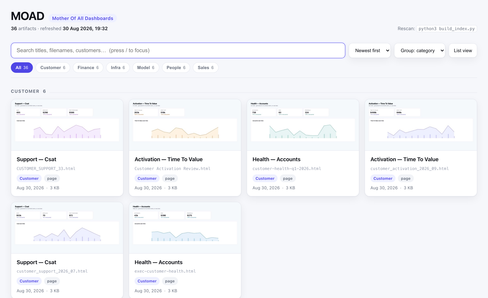

# MOAD — Mother Of All Dashboards

**Ask an AI for a dashboard and you have one in thirty seconds.** So you ask
again. And again. A year later there are hundreds of self-contained HTML files
scattered across your machine — dashboards, decks, reports, architecture
diagrams — each genuinely useful the day it was made, and collectively
unfindable.

That's the new failure mode. Producing an artifact used to be the expensive
part, so you made few of them and you remembered each one. Now producing is
nearly free and *finding* is the bottleneck. `ls | grep` across four hundred
files named `AI_Cost_Dashboard_6.html` is not a retrieval system, and neither
is opening five of them to work out which is the right one.

MOAD is the index. One page listing every HTML artifact you have generated,
each with a rendered thumbnail, because you recognise a dashboard by looking at
it rather than by parsing its filename. Point it at a directory, open
`index.html`, click straight through to the real file. New artifacts show up on
their own.

It is deliberately small and boring: no server, no build step, no dependencies
for the core (Python 3 and a browser you already have). `index.html` is
generated — open it, don't edit it.



*Screenshot taken against the synthetic corpus from `demo/generate_demo.py` — real
UI, invented data.*

```
./refresh.sh          # rescan + thumbnail new files + rebuild   ← the one command
open index.html
```

## Files

| File | What it is |
|---|---|
| `index.html` | **The hub.** Generated. Search, category filters, sort, grid/list, thumbnails. |
| `build_index.py` | Scanner + generator. Reads titles from the first 64 KB of each file (some are 19 MB). |
| `make_thumbs.py` | Playwright screenshot pass. Cached on `path+mtime`, so reruns only render what's new. |
| `dashboards.json` | Your local registry: roots, depth, category rules, overrides. Gitignored. |
| `dashboards.example.json` | Copy it to `dashboards.json` to get started. |
| `thumbs/` | JPEG cache, ~37 KB each. Referenced relatively, not inlined. |
| `install-watcher.sh` | Installs the launchd auto-refresh agent. |
| `com.moad.watcher.plist` | launchd template (paths substituted at install). |
| `LICENSE` | MIT. |
| `.venv/` | Playwright, for `make_thumbs.py` only. `build_index.py` needs nothing but python3. |

## Try it without pointing it at anything real

```
python3 demo/generate_demo.py ~/moad-demo 36
python3 build_index.py --root ~/moad-demo
./refresh.sh && open index.html
```

36 synthetic dashboards across six domains, five different filename conventions.
Rerunning the generator clears its own previous output — it only ever deletes files
containing its marker string, never anything else in the directory.

## Choosing which directory to index

MOAD indexes whatever directories you point it at. `~/Downloads` is only the
default because that is where browsers put things.

```
python3 build_index.py --root ~/work/reports     # use this directory instead
python3 build_index.py --add  ~/Documents/decks  # index a second one too
python3 build_index.py --remove ~/Downloads      # stop indexing one
python3 build_index.py --roots                   # what am I indexing?
./install-watcher.sh ~/work/reports              # set the root AND watch it
```

The watcher's `WatchPaths` are generated from `roots`, so the indexer and the
watcher can never point at different places. After changing roots, rerun
`./install-watcher.sh` — `build_index.py` reminds you.

Anything saved to a root shows up automatically if the watcher is installed, or
on the next `./refresh.sh` if it isn't.

## Auto-refresh (launchd watcher)

A launchd agent watches `~/Downloads` and rebuilds the hub whenever a dashboard
lands, so `index.html` is never stale — you just reload the tab.

```
./install-watcher.sh [watch-dir]                # installs the agent (default ~/Downloads)
~/Library/LaunchAgents/com.moad.watcher.plist   # WatchPaths on the watch dir
watch-refresh.sh                                         # debounce + guard + refresh.sh
watch.log                                                # one line per real rebuild
watch-launchd.log                                        # launchd's own stdout/stderr
```

`watch-refresh.sh` does three things before it spends any time:

1. **Locks** — a second trigger during a rebuild is a no-op.
2. **Settles** — waits 3s of quiet, so Chrome's `.crdownload` → rename doesn't
   rebuild twice.
3. **Fingerprints** — name + size + mtime of every indexed `*.html`. If a PDF or a
   zip landed instead of a dashboard, it exits in ~0.5s without launching anything.

Measured: ~0.5s for an idle wake, ~2.8s to index and thumbnail one new dashboard.

```
launchctl print gui/$UID/com.moad.watcher    # status
tail -f watch.log                                     # watch it work

launchctl bootout gui/$UID/com.moad.watcher  # stop
launchctl bootstrap gui/$UID ~/Library/LaunchAgents/com.moad.watcher.plist  # start
rm ~/Library/LaunchAgents/com.moad.watcher.plist   # uninstall (after bootout)
```

**macOS TCC gotcha, learned the hard way.** Under launchd, `/bin/bash` is denied a
directory listing of `~/Downloads` — a glob there silently returns the literal
pattern, not a file list — while `python3` in the *same job* reads it fine. So the
fingerprint is computed in python. A bash `stat`/glob implementation hashes the empty
string, every trigger compares empty-to-empty, and the watcher silently never fires.
If the fingerprint ever comes back empty the script logs `ABORT` and refuses to
rebuild, rather than recording a valid-looking hash.

Two limits worth knowing: `WatchPaths` is not recursive (top level only, matching
`max_depth: 1`), and launchd can drop an event that lands mid-rebuild. Nothing
breaks — the next trigger, or the next login, resyncs.

## Categories

**You don't configure them.** MOAD reads your filenames and titles and works out
the categories itself, every rebuild, so they keep up as your corpus grows.

```
$ ./refresh.sh
categories (auto): Sales, Infra, People, Model, Finance, Customer
indexed 36 artifacts -> index.html
```

It tokenises each filename and title, throws away dates, version numbers and
format words (`report`, `final`, `v2`, `2026`), and keeps the words that group
the most files — preferring words that appear in titles, since those make better
labels. Anything that doesn't group lands in `Other`.

### If you want control

See what it would pick, without changing anything:

```
python3 build_index.py --suggest-categories
```

Freeze that set so it stops changing as files are added:

```
python3 build_index.py --suggest-categories --apply
```

That writes a `category_rules` list into `dashboards.json`, which you can then
edit by hand. `[regex, label]` pairs, tested with `re.search` against the
filename followed by the title, **first match wins**, `Other` if none match. Set
`"category_rules": "auto"` to go back to automatic.

Note `re.search`, not `match` — `ai` matches anywhere in the name, so anchor with
`^` if you mean "starts with". And order matters: specific patterns before
general ones. An explicit `category` in `overrides` beats every rule.

Automatic mode won't invent a hierarchy. On a 417-file corpus it found nine
categories and left 54 in `Other`; it grouped 260 files under one label where a
human would have split out a sub-group. Freeze and edit if that bothers you.

## Overrides

Rescans refresh titles/dates/sizes but never touch `overrides` in `dashboards.json`:

```json
"overrides": {
  "~/Downloads/quarterly_review.html": {
    "title": "Q3 Review",
    "category": "Exec / Quarterly",
    "pinned": true,
    "tags": ["weekly"]
  },
  "~/Downloads/scratch.html": { "hidden": true }
}
```

`pinned` floats an item to the top of every view. `hidden` drops it from the index.

## Settings in `dashboards.json`

- `roots` — directories to scan.
- `category_rules` — your own `[regex, label]` pairs, first match wins, anything
  unmatched is `Other`. Categories are yours; the tool ships only generic defaults.
- `customer_pattern` — optional regex with one capture group, to pull a customer or
  team name out of a filename. Empty (default) turns the feature off.
- `max_depth` — `1` = top level only. Raise it to pull in report bundles from
  subfolders (`~/Downloads` may hold many more HTML files one level down).
- `exclude_globs` — e.g. `["*_draft.html", "*copy*.html"]`.

## Keyboard

`/` focus search · `Esc` clear · click a card to open it in a new tab.

## Note

The hub links to absolute `file://` paths on this machine. Unlike the dashboards it
indexes, it is deliberately *not* portable — emailing it gets you a page of dead links.

## License

MIT — see [LICENSE](LICENSE).
